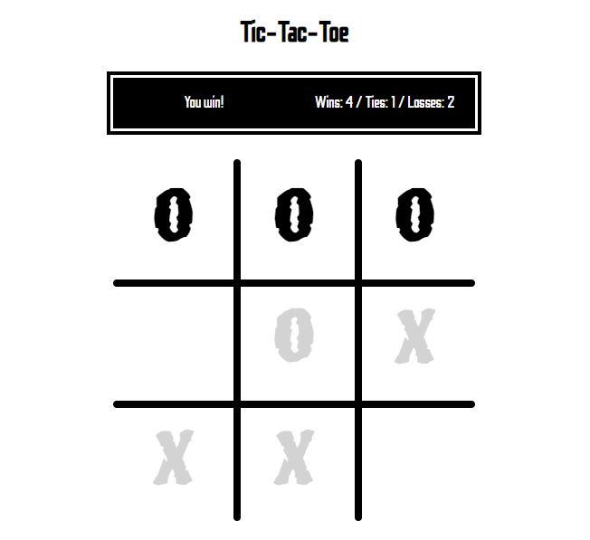

# Tic-Tac-Toe
An online tic-tac-toe game with `HTML` and `JavaScript (jQuery)`.
- `HTML` : Create basic elements for the game
- `CSS` : Style and position elements on the screen, animate objects
- `JavaScript` : Apply game logic and mechanisms
- `Cookies` : Store data about win-loss records of the user
  - Resets all data after one week (7 days)

